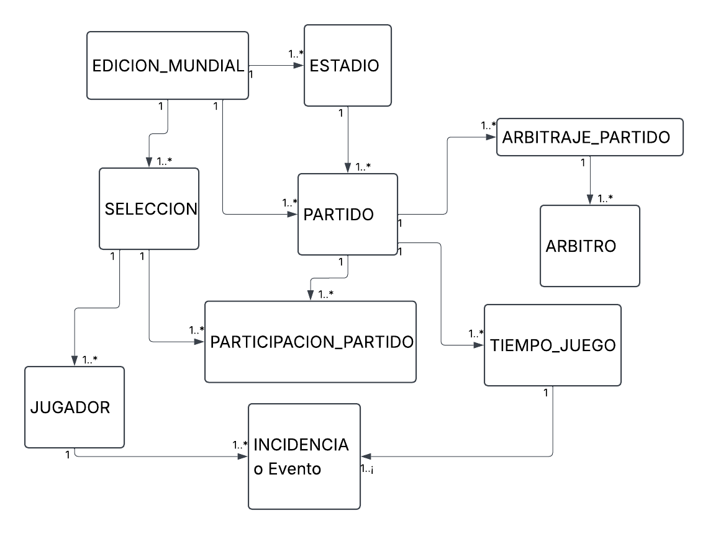

# Evaluación Crítica del Modelo Inicial y Propuesta de Expansión

Este documento presenta el análisis técnico del modelo relacional inicial de 5 tablas para el sistema de la Copa Mundial de la FIFA, identificando sus limitaciones funcionales y proponiendo una arquitectura extendida para soportar el seguimiento operativo del torneo.

---

## 1. Problemas y Limitaciones Identificadas en el Modelo Inicial

El modelo base (`EDICION_MUNDIAL`, `ESTADIO`, `SELECCION`, `PARTIDO`, `PARTICIPACION_PARTIDO`) cumple con registrar resultados globales a nivel de selección, pero presenta vacíos estructurales críticos:

1. **Ausencia de Protagonistas Individuales (Jugadores):** No existe soporte para la plantilla de convocados ni alineaciones. Toda estadística individual (goleadores, asistencias, minutos jugados) es imposible de consultar.
2. **Falta de Trazabilidad de Eventos en Cancha:** El modelo solo registra el marcador final consolidado (`goles_marcados` en `PARTICIPACION_PARTIDO`). No se puede determinar en qué minuto ocurrió un gol, quién lo anotó ni qué sanciones disciplinarias (tarjetas amarillas o rojas) se aplicaron.
3. **Inexistencia del Cuerpo Arbitral:** El sistema no modela los jueces designados para los encuentros ni sus roles específicos (árbitro central, asistentes, cuarto árbitro, VAR).
4. **Desconexión Cronológica del Partido:** No contempla las fases operativas de un encuentro (tiempo reglamentario, tiempos extra, definición por penales), impidiendo la reconstrucción temporal del partido.

---

## 2. Propuesta de Nuevas Entidades

Para superar estas limitaciones, se incorporan cinco nuevas entidades al esquema relacional:

* **`JUGADOR`**: Almacena el registro de futbolistas convocados, asociándolos a su respectiva selección, con atributos como dorsal, posición habitual, nombre y fecha de nacimiento.
* **`ARBITRO`**: Representa el catálogo oficial de colegiados habilitados por la FIFA, registrando nombre, nacionalidad y categoría.
* **`ARBITRAJE_PARTIDO`**: Entidad asociativa que resuelve la relación muchos a muchos entre `PARTIDO` y `ARBITRO`, especificando el rol asignado (árbitro principal, asistente de línea, VAR, cuarto árbitro) para cada compromiso.
* **`TIEMPO_JUEGO`**: Modela los periodos oficiales en los que se divide un encuentro (Primer Tiempo, Segundo Tiempo, Prórroga, Penales), registrando tiempo de adición y estado.
* **`INCIDENCIA`**: Registra los sucesos clave del partido (goles, autogoles, tarjetas amarillas, expulsiones, sustituciones), asociando el minuto, el periodo (`TIEMPO_JUEGO`), el jugador involucrado (`JUGADOR`) y el equipo en cancha (`PARTICIPACION_PARTIDO`).

---

## 3. Relaciones y Conexiones del Esquema Extendido

* `SELECCION` (1) —— (N) `JUGADOR`
* `PARTIDO` (1) —— (N) `ARBITRAJE_PARTIDO` (N) —— (1) `ARBITRO`
* `PARTIDO` (1) —— (N) `TIEMPO_JUEGO`
* `TIEMPO_JUEGO` (1) —— (N) `INCIDENCIA`
* `JUGADOR` (1) —— (N) `INCIDENCIA`
* `PARTICIPACION_PARTIDO` (1) —— (N) `INCIDENCIA`

---

## 4. Boceto del Modelo Ampliado

A continuación se presenta el diagrama conceptual que ilustra la integración de las cinco entidades iniciales con las cinco entidades propuestas:

